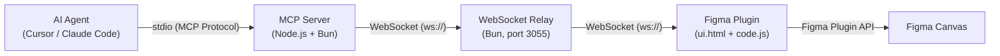
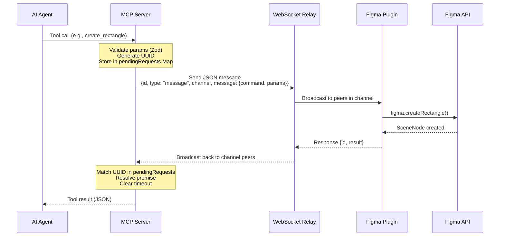
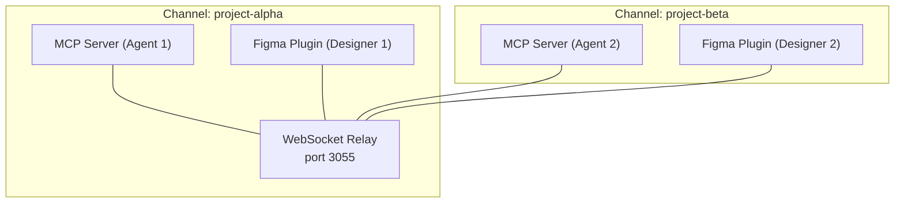
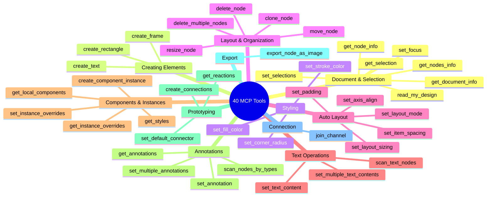

# Architecture

This project is a three-component pipeline that lets AI agents (Cursor, Claude Code) manipulate Figma designs programmatically. An MCP server translates tool calls into commands, a WebSocket relay routes those commands by channel, and a Figma plugin executes them against the Figma API.

All three pieces must be running for anything to work. The MCP server talks stdio with the agent and WebSocket with the relay. The relay is a dumb pipe — it just broadcasts messages within a channel. The plugin does the real work inside Figma's sandbox.

## Component Diagram



The MCP server (`src/talk_to_figma_mcp/server.ts`) is the brain — it registers 40 tools, validates parameters with Zod, assigns UUIDs to every request, and tracks pending responses in a Map.

The WebSocket relay (`src/socket.ts`) is ~200 lines of Bun. It maintains a `channels` Map of connected clients and broadcasts messages to peers in the same channel. That's it.

The Figma plugin (`src/cursor_mcp_plugin/`) runs inside Figma's plugin sandbox. `code.js` has a `handleCommand` switch statement dispatching 30+ commands. `ui.html` manages the WebSocket connection to the relay and bridges messages to/from the plugin main thread via `figma.ui.postMessage`.

## Request Lifecycle

Every command follows this exact path:



Key detail: the relay broadcasts to all **other** clients in the channel (not the sender). This prevents echo and ensures the request-response pattern works correctly.

## Channel Isolation

The relay supports multiple simultaneous sessions through channel-based routing. This is how two designers can use the tool at the same time without interfering with each other.



How it works:

1. **Join**: Both the MCP server and the Figma plugin send `{type: "join", channel: "some-name"}` to the relay. The relay adds them to a `Set` in its `channels` Map.
2. **Route**: When a message arrives with `{type: "message", channel: "some-name"}`, the relay only broadcasts to other clients in that same channel's Set.
3. **Isolate**: Messages in `project-alpha` never reach clients in `project-beta`. The relay checks channel membership before every broadcast.
4. **Cleanup**: When a WebSocket closes, the client is removed from all channels it joined.

The MCP server tracks its current channel in a `currentChannel` variable. It refuses to send commands before `join_channel` is called. The Figma plugin UI lets users type in a channel name and click "Join."

## Timeout & Error Handling

The MCP server doesn't just fire and forget. Every command is tracked:

- **30-second default timeout**: Each request gets a `setTimeout` that rejects the promise if no response arrives. The timeout ID is stored in the `pendingRequests` Map alongside `resolve`/`reject` callbacks.

- **Progress updates reset the timer**: For long operations (like scanning hundreds of text nodes), the plugin sends `progress_update` messages. When the MCP server receives one, it clears the existing timeout and sets a new 60-second inactivity timer. This prevents false timeouts during chunked operations.

- **Chunking for large operations**: Operations like `scan_text_nodes` process nodes in batches. The plugin sends progress updates after each chunk (`{status: "in_progress", progress: 45, processedItems: 90, totalItems: 200}`), yielding control back to the Figma UI thread between chunks to prevent freezing.

- **Auto-reconnect**: If the WebSocket connection drops, the MCP server retries after 2 seconds.

- **Structured errors**: Every tool handler wraps its `sendCommandToFigma` call in try/catch. Errors are returned as MCP text content, not thrown — so the agent gets a useful error message instead of a protocol-level failure.

## Data Transformations

The MCP server does some translation between what the agent sees and what Figma uses internally.

### Color Space: RGBA 0-1 to Hex

Figma stores colors as `{r, g, b, a}` with each channel in the 0-1 range. The `rgbaToHex` function converts these to `#RRGGBB` (or `#RRGGBBAA` if alpha isn't 255) before returning them to the agent. This runs on fills, strokes, and gradient stops.

```
Figma internal:  {r: 0.2, g: 0.4, b: 0.8, a: 1.0}
Agent sees:      "#3366CC"
```

Tools that accept colors (`set_fill_color`, `set_stroke_color`) take the raw 0-1 floats, not hex. So the conversion is read-only.

### Node Filtering

The `filterFigmaNode` function strips Figma's verbose node data down to essentials before returning it:
- Skips `VECTOR` type nodes entirely (returns `null`)
- Removes `boundVariables` and `imageRef` from fills/strokes
- Converts all color values to hex
- Keeps: `id`, `name`, `type`, `fills`, `strokes`, `cornerRadius`, `absoluteBoundingBox`, `characters`, `children` (recursively filtered)

This keeps responses small enough for agents to process without blowing context windows.

### Logging Discipline

All server logs go to `stderr`. `stdout` is reserved exclusively for MCP protocol messages. This is critical — anything accidentally written to stdout would corrupt the stdio-based MCP transport.

## Tool Categories

The server exposes 40 tools organized into these groups:



Plus 6 MCP prompts that guide agents through multi-step workflows: `design_strategy`, `read_design_strategy`, `text_replacement_strategy`, `annotation_conversion_strategy`, `swap_overrides_instances`, and `reaction_to_connector_strategy`.

## File Map

```
src/
├── talk_to_figma_mcp/
│   └── server.ts          # MCP server — tool definitions, WebSocket client, request tracking
├── socket.ts              # WebSocket relay — channel routing, broadcast logic
└── cursor_mcp_plugin/
    ├── manifest.json      # Figma plugin manifest (permissions, entry points)
    ├── code.js            # Plugin main thread — command dispatcher, Figma API calls
    └── ui.html            # Plugin UI — WebSocket connection management, message bridge
```

The plugin is not bundled or transpiled. `code.js` is written directly as vanilla JavaScript and runs as-is in Figma's plugin sandbox.
