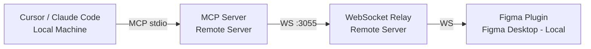

# Troubleshooting

Quick fixes for common setup and connection issues with Talk to Figma MCP.

## Quick Diagnosis Checklist

Run through these in order. Most problems are one of these five things.

### 1. Is the WebSocket server running?

```bash
bun socket
```

You should see: `WebSocket server running on port 3055`

Verify it's reachable:

```bash
curl http://localhost:3055
# Expected: "WebSocket server running"
```

### 2. Is the MCP server connected?

In Cursor, check Settings > MCP. `TalkToFigma` should show a green status. If it shows red or "0 tools enabled", the MCP server can't reach the WebSocket relay.

For Claude Code:

```bash
claude mcp list
```

### 3. Is the Figma plugin installed and running?

Open Figma Desktop. Go to Plugins > Development > Cursor Talk to Figma MCP Plugin. If you installed from the [community page](https://www.figma.com/community/plugin/1485687494525374295/cursor-talk-to-figma-mcp-plugin), find it under Plugins > Cursor Talk to Figma MCP Plugin.

The plugin UI should show "Connected" after connecting to the WebSocket server.

### 4. Did you join a channel?

Both the MCP server and the Figma plugin must join the **same channel**. Use the `join_channel` tool from your AI agent, and enter the same channel name in the Figma plugin UI.

If there's a mismatch, commands will silently go nowhere.

### 5. Is port 3055 accessible?

```bash
lsof -i :3055
```

If another process holds the port, kill it or set a custom port:

```bash
PORT=3056 bun socket
```

---

## Common Errors

| Error | Cause | Fix |
|---|---|---|
| "0 tools enabled" in Cursor | MCP server can't connect to WebSocket relay | Make sure `bun socket` is running. Check that port 3055 is not blocked. Restart Cursor. |
| Timeout after 30s | Figma plugin not responding | Verify the plugin is running in Figma. Rejoin the channel. Check the WebSocket relay terminal for `No other clients in channel` warnings. |
| `CERT_HAS_EXPIRED` or certificate errors | Bun SSL certificate issue (common on Windows) | Set `NODE_TLS_REJECT_UNAUTHORIZED=0` in your environment, or update Bun to the latest version. See [#102](https://github.com/grab/cursor-talk-to-figma-mcp/issues/102). |
| `Connection refused` on port 3055 | WebSocket server not running, or port conflict | Start the server with `bun socket`. If the port is in use: `lsof -i :3055` then kill the process. |
| `error: An internal error occurred (InvalidWtf8)` | Bun encoding issue | Update Bun to latest: `bun upgrade`. If that fails, reinstall Bun. See [#82](https://github.com/grab/cursor-talk-to-figma-mcp/issues/82). |
| Plugin stuck on "Loading..." | Plugin failed to initialize WebSocket connection | Close and reopen the plugin. Make sure `bun socket` is running before launching the plugin. See [#87](https://github.com/grab/cursor-talk-to-figma-mcp/issues/87). |
| `Cannot start MCP server` / `bun start` errors | Missing build step or wrong command | Run `bun install` first, then use `bun socket` for the relay and let Cursor handle the MCP server via `bunx`. See [#134](https://github.com/grab/cursor-talk-to-figma-mcp/issues/134). |
| Commands work but elements appear outside the frame | Coordinates are absolute, not relative to parent | Use `get_document_info` and `get_node_info` to find the parent frame's position, then calculate coordinates relative to it. |

---

## Platform-Specific Notes

### macOS

Standard setup. No special configuration needed.

```bash
# Install Bun
curl -fsSL https://bun.sh/install | bash

# Start socket
bun socket
```

If you use a firewall (Little Snitch, LuLu), allow connections on port 3055 for localhost.

### Windows / WSL

Windows requires extra steps because the WebSocket server defaults to `localhost` which may not be reachable from Figma Desktop.

1. **Install Bun natively** (not inside WSL):

```powershell
powershell -c "irm bun.sh/install.ps1|iex"
```

2. **Bind to all interfaces.** In `src/socket.ts`, uncomment the hostname line:

```typescript
// uncomment this to allow connections in windows wsl
hostname: "0.0.0.0",
```

3. **Firewall.** Allow inbound connections on port 3055. In PowerShell (admin):

```powershell
New-NetFirewallRule -DisplayName "Figma MCP WebSocket" -Direction Inbound -Port 3055 -Protocol TCP -Action Allow
```

4. **WSL port forwarding** (if running `bun socket` inside WSL):

```powershell
netsh interface portproxy add v4tov4 listenport=3055 listenaddress=0.0.0.0 connectport=3055 connectaddress=$(wsl hostname -I | ForEach-Object { $_.Trim() })
```

See [#83](https://github.com/grab/cursor-talk-to-figma-mcp/issues/83) for more details on remote/WSL setups.

### Linux

Same as macOS. If running a desktop firewall (ufw, firewalld), open port 3055:

```bash
# ufw
sudo ufw allow 3055/tcp

# firewalld
sudo firewall-cmd --add-port=3055/tcp --permanent && sudo firewall-cmd --reload
```

---

## Remote Server Setup

You can run the MCP server and WebSocket relay on a remote machine while Figma runs locally. This is useful for headless dev environments or cloud workstations.

### Architecture



### Port Forwarding

Forward port 3055 from the remote server to your local machine:

```bash
# SSH tunnel (run on your local machine)
ssh -L 3055:localhost:3055 user@remote-server
```

The Figma plugin connects to `localhost:3055` which tunnels to the remote server.

### WSS / HTTPS Considerations

The Figma plugin connects via `ws://` (unencrypted) by default. If you need WSS:

1. Put a reverse proxy (nginx, Caddy) in front of the WebSocket server.
2. Terminate TLS at the proxy and forward to `ws://localhost:3055` internally.
3. Update the plugin's connection URL to use `wss://your-domain:443`.

Example nginx config:

```nginx
server {
    listen 443 ssl;
    server_name figma-mcp.example.com;

    ssl_certificate /path/to/cert.pem;
    ssl_certificate_key /path/to/key.pem;

    location / {
        proxy_pass http://127.0.0.1:3055;
        proxy_http_version 1.1;
        proxy_set_header Upgrade $http_upgrade;
        proxy_set_header Connection "upgrade";
        proxy_set_header Host $host;
    }
}
```

> **Note:** The Figma plugin UI hardcodes `ws://localhost:3055`. For remote setups, you'll need to modify `src/cursor_mcp_plugin/ui.html` to point to your remote address, or use SSH port forwarding so `localhost:3055` still works.

---

## FAQ

**Q: Can I change the WebSocket port?**

Yes. Set the `PORT` environment variable:

```bash
PORT=3056 bun socket
```

Then update your Figma plugin connection and MCP server config to use the same port. See [#124](https://github.com/grab/cursor-talk-to-figma-mcp/issues/124).

**Q: Can I run multiple Figma projects at once?**

Yes, by running multiple WebSocket servers on different ports and using separate channels. Each Cursor/Claude Code workspace connects to its own MCP server instance pointing to the appropriate port.

**Q: The AI creates ugly/broken designs. Is that a tool problem?**

The MCP tools create exactly what the AI agent asks for. Design quality depends on the prompt and the AI model's design capabilities. Tips:
- Use detailed, specific prompts with exact dimensions, colors, and spacing.
- Reference existing components with `get_local_components` before creating new elements.
- Use auto-layout (`set_layout_mode`) instead of absolute positioning.
- See [#121](https://github.com/grab/cursor-talk-to-figma-mcp/issues/121) and [#88](https://github.com/grab/cursor-talk-to-figma-mcp/issues/88).

**Q: How do I use custom/local components?**

Use `get_local_components` to list available components, then `create_component_instance` with the component key. Components must be published or local to the current file. Library components from external files are not yet supported ([#79](https://github.com/grab/cursor-talk-to-figma-mcp/issues/79), [#119](https://github.com/grab/cursor-talk-to-figma-mcp/issues/119)).

**Q: `export_node_as_image` returns empty or doesn't work?**

The tool returns base64-encoded image data. Some AI clients may not display it inline. Check the WebSocket relay terminal logs for the actual response data. See [#125](https://github.com/grab/cursor-talk-to-figma-mcp/issues/125).

**Q: The `@modelcontextprotocol/sdk` has security vulnerabilities?**

Pin to `^1.26.0` or later in `package.json` and run `bun install`. See [#148](https://github.com/grab/cursor-talk-to-figma-mcp/issues/148).

---

## Still Stuck?

1. Check the WebSocket relay terminal for error messages.
2. Open browser DevTools console in Figma Desktop (Help > Toggle Developer Tools) to see plugin-side errors.
3. Search [existing issues](https://github.com/grab/cursor-talk-to-figma-mcp/issues) before opening a new one.
4. When filing an issue, include: OS, Bun version (`bun --version`), Cursor/Claude Code version, and the full error output.
